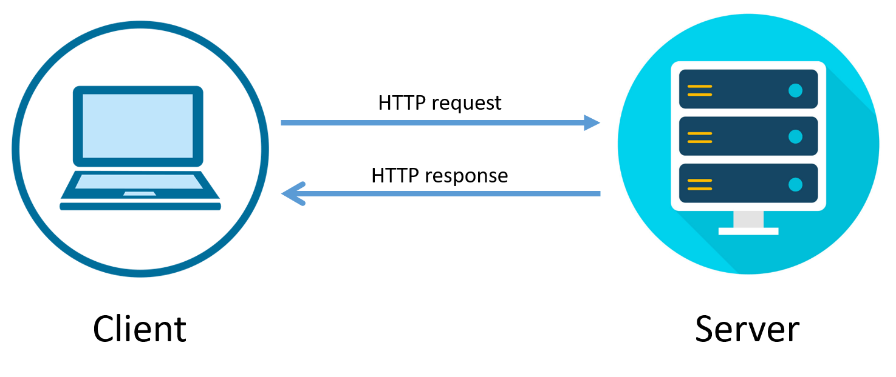

# An Application Tutorial

## Purpose
This is a Node.js application that uses [Sequelize](https://sequelize.org/) and [Passport](http://www.passportjs.org/) to manage member sign ins and sign ups at a website. Passport is used to authenticate a member's username and password. Sequelize is used to retrieve and gather member information from a database. It is also used to create new entries in the database for new member sign ups.

## Emoji Legend
Emoji | Meaning
------|--------
⬇️ | A dependent file that is refereneced/imported
⬆️ | Item exported to be reference in another file
🔃  | Request/Response between client & server

## How It Works

### Config
* The *config.json* file stores details about the environment the database will run in. If it is a production environment, the database referenced will be one that is deployed (ie. Heroku). Otherwise, the database will be a localhost database for development or testing.

* The *passport.js* file uses Passport to authenticate a user's email and password and verifies they are in the database. It includes the db that is exported from the models directory. It will send a message to the user if they have an incorrect email or password. Otherwise, it will return the user. Passport is then exported to be used in other files.
    * ⬇️  --db
    * ⬆️  --passport

* The *isAuthenticated.js* file is middleware that restricts routes a user can visit based on if they are logged in or not. If they are not logged in, they cannot continue to the restricted route and are redirected to the login page.
    * ⬆️  --isAuthenticated

### Models
* The *index.js* file determines which database from the *config.json* file should be used. If in a production environment, it will use the deployed database (i.e. Heroku). Otherwise, it will run the local database for development or testing. It then reads through all the JavaScript files in the models directory and runs them through Sequelize. This gives all the models access to Sequelize's methods. It also sets up any associations between models to ensure they link properly. All of this is then exported as "db" to be used in other files.
    * ⬇️ --*config.json*
    * ⬆️  --db

* The below code illustrates the logic of how a database is determined for use. It also illustrates how all models are run through Sequelize and how everything is exported to be referenced in other files.

* The *user.js* file is a model for this application. Through Sequelize it creates a "User" table in the database. The table has fields for email and password. Bcrypt is used to encrypt the password before it is stored in the database. The User model also has a method for validating passwords through bcrypt. The model is exported to be used in other files.
    * ⬆️  --User
    
* The below code illustrates how a new Sequelize model is created which adds a User table to the database.

    

### Request and Response Between Client & Server
Below is an image that shows how a client sends a request to a server, and how a server sends a response to the client. Requests and responses are sent via the routes. The JavaScript files in the public directory allow clients to make requests. The JavaScript files in the routes directory allow the server to listen for requests and send responses back to the client.

### Routes
* The *api-routes.js* file sets up the back-end server routes for the application. It requires all the models that are imported from the *index.js* file as db. It also requires passport which is imported from *passport.js*. All the routes are exported to be used in other files.
    * ⬇️ --db
    * ⬇️ --passport
    * ⬆️ --api-routes

    * In the login route, the passport authenticate middleware is used to validate a user's login credentials before logging them in.
        * 🔃  --receives POST requests from *login.js* and sends response
    * In the signup route, a user's email and password are stored as new entries in the database through Sequelize. The password is automatically hashed due to how the User model was configured. 
        * 🔃  --receives POST requests from *signup.js* and sends response
    * In the logout route, a user is logged out of their account.
    * In the user_data route, a user's email and id will be returned through Sequelize if they are signed in. 
        * 🔃  --receives GET requests from *memebers.js* and sends response
* The *html-routes.js* file contains routes that determine which HTML file to render depending on the URL. It requires the isAuthenticated middleware from the config directory. The routes are exported to be used in other files.
    * ⬇️  --isAuthenticated
    * ⬆️  --html-routes
    * In the "/" route, a user is redirected to the *members.html* page if they already have an account. Otherwise, the *signup.html* page is rendered.
        * 🔃 --receives GET requests to the "/ "route and sends HTML file response or redirects
    * In the "/login" route, a user is redirected to the *members.html* page if they already have an account. Otherwise, the *login.html* page is rendered.
        * 🔃 --receives GET requests to the "/login" route and sends HTML file response or redirects
    * In the "/members" route, the isAuthenticated middlware verifies if a user is logged in before they can access the route. If they are logged in, the *members.html* page will render. Otherwise, they will be redirected to the *signup.html* page.
        * 🔃 --receives GET requests to the "/members" route and sends HTML file response

### Public Files
Below is an image of the login page

* The *login.js* file validates user inputs to the form on the *login.html* page when they click submit. It checks if there is an email and password entered. If there is a valid email and password, it makes a POST request to the server via the login route and sends the email and password. Once a response is received from the server, it redirects the user to the members page.
    * 🔃 --sends POST requests to login API route
* The *members.js* file sends a GET request to the server via the user_data route. Once a response is received from the server, it displays the user's email on the *members.html* page.
    * 🔃 --sends GET requests to user_data API route
* The *signup.js* file validates user inputs to the form on the *signup.html* page when they click submit. It checks that the email and password fields are not blank. If an email and password are entered, it will send a POST request to the server via the signup route with the email and password. If successful, it will then redirect the user to the members page.
    * 🔃 --sends POST requests to signup API route
* The *login.html* file includes the HTML for the login page. There is a form for the user to enter their email and password for login.
    * ⬇️ --*login.js*
    * ⬇️ --*style.css*
* The *members.html* file includes the HTML for the members page. There is a div that will display "Welcome" + the member's name.
    * ⬇️ --*members.js*
    * ⬇️ --*style.css*
* The *signup.html* file includes the HTML for the signup page. There is a form for the user to enter their email and password to sign up.
    * ⬇️ --*signup.js*
    * ⬇️ --*style.css*
* The *style.css* file formats forms with a top margin of 50px.

### Server
* The *server.js* file runs the server for the application. It requires passport which is imported from *passport.js*. It also requires all the models which are imported from *index.js* as db. And it requires the HTML and API routes. It configures the middleware that is needed for authentication and keeps track of a user's login status. Lastly, it syncs the database and console logs a message to the user if the connection is successful.
    * ⬇️  --passport
    * ⬇️  --db
    * ⬇️  --api-routes
    * ⬇️  --html-routes

## Updates for Future Development
Now that the application is set up with sign in and sign up functionality, the next step would be to build out additional features. Since the database has little information about users, it would be helpful to gather additional details about them in order to build a website that better suits their needs. The next feature could allow users to add information to their account through a form that then sends a PUT request. Some additional information they might like to add is their location, birthdate, preferences, etc. 

Conversley, if a user would like to no longer be a member of the website, there could be a feature added that allows them to delete their account. This would send a DELETE request to remove the user from the database.

## Credits
[Bytes of Gigabytes](https://bytesofgigabytes.com/networking/how-http-request-and-response-works/) - the request and response image

## Author
* Rebecca Eng
* [GitHub](https://github.com/engrebecca)
* [LinkedIn](https://www.linkedin.com/in/engrebecca/)